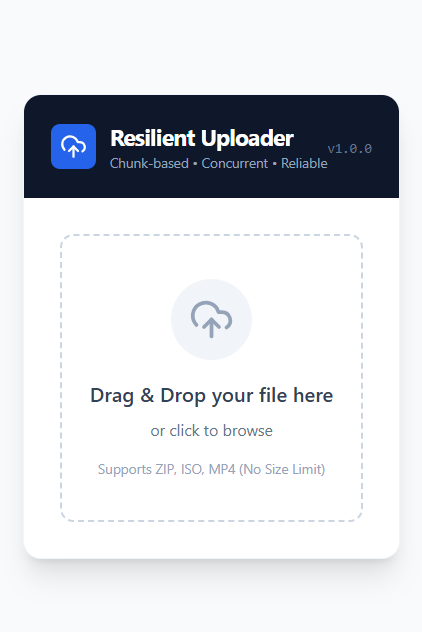
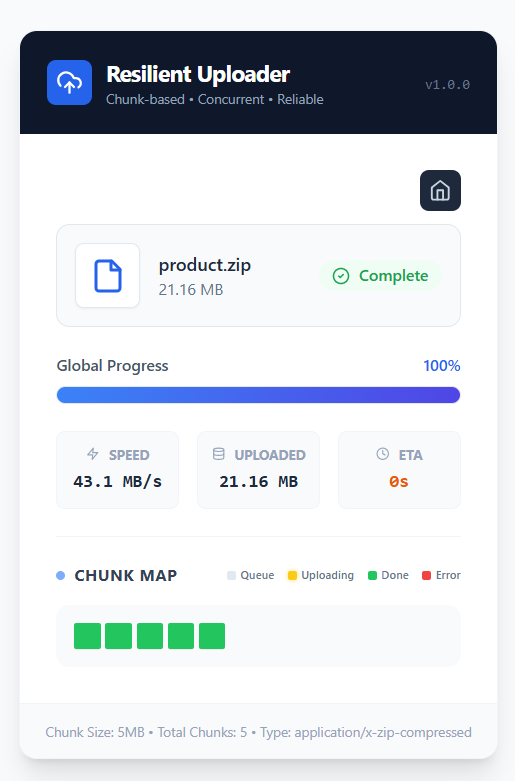

# 🚀 Resilient Large File Uploader

A robust, fault-tolerant file upload system engineered to handle large datasets (GBs) over unstable networks. Features **chunk-based streaming**, **concurrency control**, and **automatic resumability**.

## 📸 Project Screenshots

<p align="center">
  
  
</p>

## 🌟 Key Features

* **Chunk-Based Uploading:** Splits large files into **5MB chunks** using the `Blob.slice()` API, preventing memory crashes.
* **Smart Concurrency:** Implements a custom queue manager to limit active requests to **3 parallel uploads**, preventing browser freezing.
* **Automatic Resumability:** "Handshakes" with the server before uploading. If a user refreshes or loses internet, the upload resumes exactly where it left off (zero data loss).
* **Network Resilience:** Features an **Exponential Backoff Retry** mechanism (retries failed chunks 3 times with increasing delays).
* **Visual Analytics:** Real-time calculation of **Upload Speed**, **ETA**, and a **Chunk Visualization Grid** to monitor individual part status.

## 🛠️ Tech Stack

**Frontend:**
* React.js (Vite)
* Tailwind CSS (Styling)
* Lucide React (Icons)
* Axios (HTTP Requests)

**Backend:**
* Node.js & Express
* MongoDB (Mongoose) - Stores upload state & metadata
* FS (File System) - Uses `fs.write` with offsets for random access writing
* Yauzl - Stream-based ZIP inspection

## 🚀 Getting Started

Follow these steps to run the project locally.

### Prerequisites
* Node.js (v16+)
* MongoDB (Running locally or Atlas URL)

### 1. Clone the Repository
```bash
git clone [https://github.com/sujalbanakar/resilient-file-uploader.git](https://github.com/sujalbanakar/resilient-file-uploader.git)
cd resilient-file-uploader